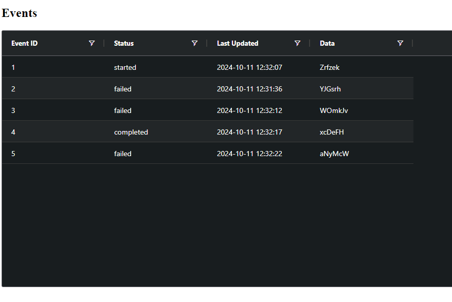

# alchem-interview

# Frontend

Angular

# Backend

Python - Fast API

# Database

SQLite

# Event Simulator

Python Script

## Understand And Bullet Points Requirements
## Visualise The Problem And Data Flow
## Choose Technologies And Tools
## Consider Future Issues/Improvements/Scalability
## Define Models And Schemas
## Create Prototypes

# Running

## Frontend

ng serve --port 5010

## Backend

uvicorn main:app --reload

## Event Simulator

python event_simulator.py

# Testing

# Possible Improvements
- Unit and end to end tests
- Setup API service to scale with other endpoints
- Use a message broker and queue like Kafka to manage and send events and decouple the systems
- Use a more scalable and production ready database like PostgreSQL or MySQL, DynamoDB
- Add retry requests, validation and error handling
- Add API authentication 
- Use AWS Lambda and API Gateway for the API endpoints

